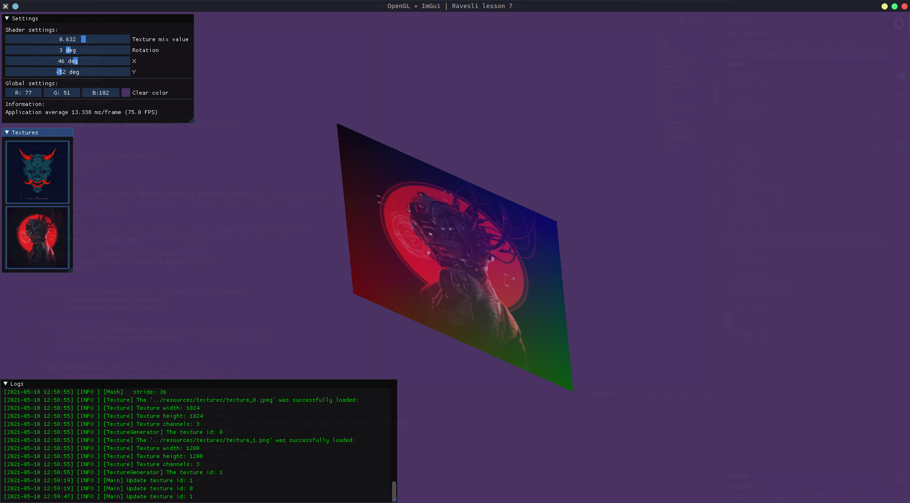

# My OpenGL learning repository

### Yeap. This is just a repo for my practice in opengl with other interesting stuff

### All materials I take from [this site][learnopengl]

--------------------------

### Current status: Lesson_7 is not completed. I have to add some transformations. But right now this sh*t is looking pritty good, I think:

    

<!-- The other stuff, huh -->
[learnopengl]: https://learnopengl.com
